# Relatório Técnico — Tech Challenge Fase 1

## Sistema Inteligente de Suporte ao Diagnóstico em Saúde Feminina

**Curso:** Pós-Graduação em IA para Devs — FIAP  
**Grupo:** Guilherme Ferreira de Arruda  
**Proposta:** A — Saúde da Mulher  
**Dataset:** Breast Cancer Wisconsin (Diagnostic)  
**Repositório:** https://github.com/GFerreira1902/TechChallenge1GFA

**Vídeo de Demonstração:** https://youtu.be/pJzgbZM7OpE

---

## 1. Introdução

### 1.1 Contexto do Problema

O câncer de mama é o tipo de câncer mais comum entre mulheres no mundo. A detecção precoce é um dos fatores mais determinantes para a sobrevivência da paciente quando diagnosticado em seus estágios iniciais, tendo uma taxa de sobrevida em cinco anos que ultrapassa 90%.

Na prática clínica, a análise de biópsias por aspiração com agulha fina, chamada também de (FNA), gera medições numéricas de características celulares como raio, textura, perímetro, área e concavidade dos núcleos. Essas medições são a base do dataset utilizado que vamos ulitilzar neste projeto.

### 1.2 Objetivo

Vamos Desenvolver um modelo de Machine Learning capaz de classificar tumores de mama como **malignos** ou **benignos** a partir de 30 features clínicas extraídas de imagens de biópsias por aspiração com agulha fina, priorizando a minimização de **falsos negativos** (casos malignos classificados incorretamente como benignos), tendo em vista o risco clínico elevado desse tipo de erro que dependendo do caso, pode vir a ser fatal.

### 1.3 Escopo

- Análise exploratória dos dados
- Pré-processamento e preparação do pipeline
- Treinamento e comparação de 3 algoritmos de classificação
- Avaliação de desempenho com foco em recall da classe maligna
- Explicabilidade do modelo (Feature Importance e SHAP)
- Ajuste controlado dentro da mesma família de modelo: tuning de `class_weight` e threshold de decisão sobre a Regressão Logística vencedora, com objetivo de reduzir falsos negativos sem trocar de algoritmo

---

## 2. Dados

### 2.1 Origem

O dataset **Breast Cancer Wisconsin (Diagnostic)** foi criado pelo Dr. William H. Wolberg (University of Wisconsin) e está disponível publicamente no UCI Machine Learning Repository e no Kaggle.

### 2.2 Estrutura Original

| Campo             | Valor                                   |
| ----------------- | --------------------------------------- |
| Linhas            | 569                                     |
| Colunas           | 33                                      |
| Variável alvo     | `diagnosis` (M = maligno, B = benigno)  |
| Distribuição alvo | B: 357 (62,7%) · M: 212 (37,3%)         |
| Valores nulos     | Apenas coluna `Unnamed: 32` (100% nula) |
| Colunas removidas | `id` (sem valor clínico), `Unnamed: 32` |

### 2.3 Features Utilizadas

Foi utilizado 30 features que representam estatísticas de 10 características celulares, cada uma delas contém três variações:

- **mean** — média
- **se** — erro padrão
- **worst** — pior valor (média dos 3 maiores)

Características base: radius, texture, perimeter, area, smoothness, compactness, concavity, concave points, symmetry, fractal dimension.

---

## 3. Análise Exploratória de Dados (EDA)

### 3.1 Distribuição do Alvo

A classe benigna (B) representa puco mais de 63% dos dados e a maligna (M) pouco mais de 37%. Esse desbalanceamento moderado exige atenção na escolha de métricas, desta forma, o accuracy por si só não é suficiente.

### 3.2 Correlações

Algumas features medem coisas parecidas e por isso se comportam de forma muito similar, exemplo disso são: `radius_mean`, `perimeter_mean` e `area_mean` têm correlação acima de 0.95.

Isso não prejudica a capacidade preditiva do modelo, mas significa que os coeficientes individuais não devem ser lidos de forma isolada.

### 3.3 Distribuições por Classe

A análise visual mostrou que features como `concave points_mean`, `area_worst` e `concavity_worst` apresentam separação clara entre as classes e isso indica bom potencial de decisão.

### Gráficos — EDA

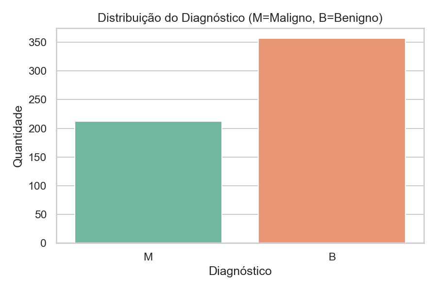

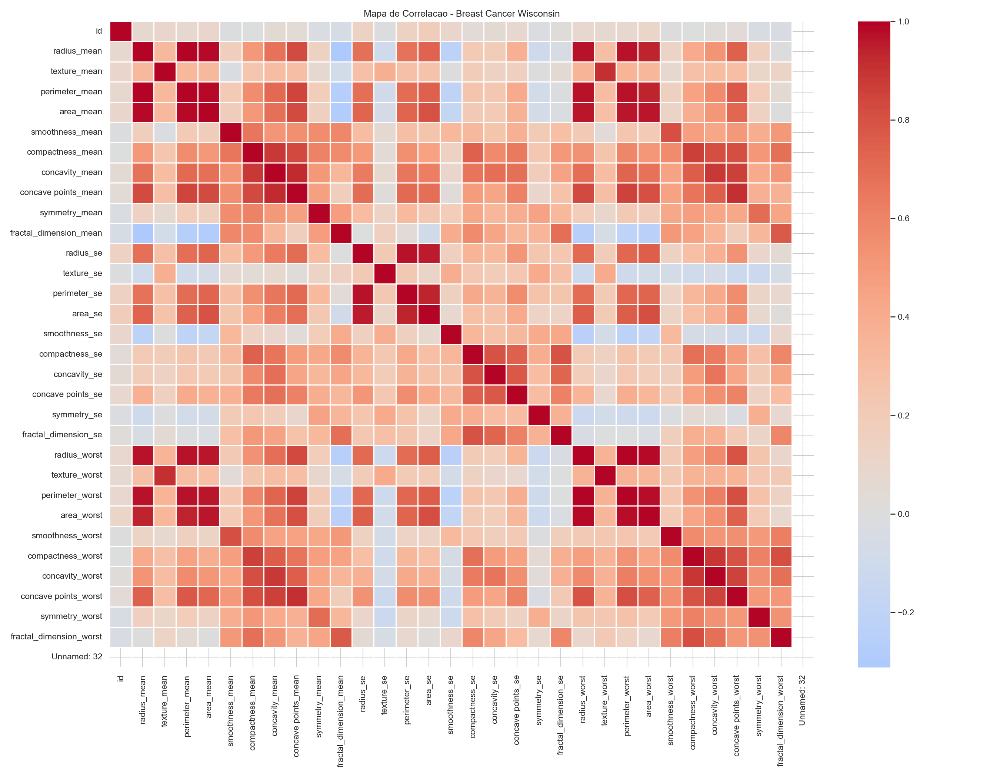

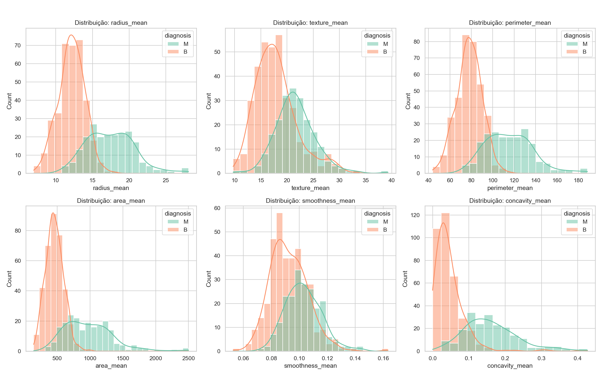

---

## 4. Pré-processamento

### 4.1 Limpeza

- Foi Removida a coluna `Unnamed: 32` (Se trata de coluna totalmente nula)
- Foi Removida a coluna `id` (coluna sem relevância nesta análise)
- Codificação do alvo: M → 1, B → 0

### 4.2 Divisão Treino/Teste

Os dados foram divididos em dois conjuntos: **treino (~80%)**, usado para o modelo aprender, e **teste (~20%)**, usado para avaliar o desempenho ao final como se fossem dados novos.

| Conjunto | Amostras | Proporção de malignos (M) |
| -------- | -------- | ------------------------- |
| Treino   | 455      | 37,4%                     |
| Teste    | 114      | 36,8%                     |

A divisão foi realizada para garantir que a proporção de casos malignos fosse a mesma nos dois conjuntos, evitando assim então, erros na avaliação.

### 4.3 Padronização

Foi Aplicado `StandardScaler` (média=0, desvio=1) ajustado **apenas no treino** e aplicado ao treino e ao teste, isso evita o famoso data leakage, quando informações externas influenciam negativamente a criação do modelo.

### Artefatos Gerados

- 8 CSVs em `data/processed/` (X_train, X_test, y_train, y_test —> versões raw e scaled)

---

## 5. Modelagem

### 5.1 Algoritmos Selecionados

| Modelo              | Justificativa para inclusão                                                                                                |
| ------------------- | -------------------------------------------------------------------------------------------------------------------------- |
| Regressão Logística | - Tem Baseline robusto e interpretável, além de ser bom para dados lineares.                                               |
| Árvore de Decisão   | Não-linear, interpretável, incluída para verificar se um modelo mais complexo supera a Regressão Logística                 |
| KNN                 | Sensível a escala dos dados, permitindo assim então validar se a padronização aplicada no pré-processamento faz diferença. |

### 5.2 Critério de Seleção

Foi definido um critério hierárquico para escolher o melhor modelo, sendo este:

1. **Maior recall da classe maligna** (focado em minimizar os falsos negativos)
2. **Maior F1 da classe maligna** (equilíbrio recall e precision)
3. **Maior accuracy** (para desempate)

Essa priorização visa o contexto clínico, dado que um falso negativo tem impacto significativo para o uso ou não do modelo em situações reais.

### 5.3 Resultados e Comparação

| Modelo              | Accuracy | Recall Maligno | F1 Maligno |
| ------------------- | -------- | -------------- | ---------- |
| Regressão Logística | 0.9649   | 0.9286         | 0.9512     |
| KNN                 | 0.9561   | 0.9048         | 0.9383     |
| Árvore de Decisão   | 0.9211   | 0.8333         | 0.8861     |

### Modelo vencedor: Regressão Logística ( foi melhor em todos os critérios.)

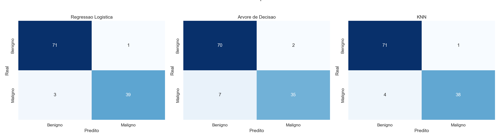

---

## 6. Avaliação e Explicabilidade

### 6.1 Métricas Detalhadas — Modelo Base

| Métrica                    | Valor  |
| -------------------------- | ------ |
| Accuracy                   | 0.9649 |
| Precision maligno          | 0.9750 |
| Recall maligno             | 0.9286 |
| F1 maligno                 | 0.9512 |
| Verdadeiros Negativos (TN) | 71     |
| Falsos Positivos (FP)      | 1      |
| Falsos Negativos (FN)      | 3      |
| Verdadeiros Positivos (TP) | 39     |

### 6.2 Análise de Erros

- **3 falsos negativos:** pacientes malignos classificados como benignos — erro clínico grave.
- **1 falso positivo:** paciente benigno classificado como maligno — risco baixo, dado que geraria solicitação de exames adicionais e teria o diagnóstico correto do falso positivo comesses adicionais.

A prioridade do projeto foi reduzir os falsos negativos sem impactar siginficativamente o resultado final.

### 6.3 Feature Importance

As 10 features com maior impacto no modelo (por valor absoluto do coeficiente):

| #   | Feature             | Coeficiente | Direção           |
| --- | ------------------- | ----------- | ----------------- |
| 1   | texture_worst       | +1.434      | Puxa para maligno |
| 2   | radius_se           | +1.233      | Puxa para maligno |
| 3   | symmetry_worst      | +1.061      | Puxa para maligno |
| 4   | concave points_mean | +0.953      | Puxa para maligno |
| 5   | concavity_worst     | +0.911      | Puxa para maligno |
| 6   | area_se             | +0.909      | Puxa para maligno |
| 7   | compactness_se      | −0.907      | Puxa para benigno |
| 8   | area_worst          | +0.900      | Puxa para maligno |
| 9   | radius_worst        | +0.897      | Puxa para maligno |
| 10  | concavity_mean      | +0.782      | Puxa para maligno |

**Interpretação:** A maioria das features mais influentes empurra a decisão para maligno quando têm valores de coeficientes altos. No top 10, a única exceção é `compactness_se` (−0.907), que quando alto puxa para benigno. No top 15, `fractal_dimension_se` (−0.594) também apresenta coeficiente negativo, sendo a segunda feature com direção oposta à malignidade.

### 6.4 SHAP — Explicação em contexto global

Foi Utilizado o SHAP com `LinearExplainer` para entender a contribuição de cada feature nas decisões do modelo.

- **SHAP Bar plot:** confirma o ranking de importância global, com `texture_worst`, `radius_se` e `concave points_mean` no topo.
- **SHAP Beeswarm:** mostra que valores altos das features mais relevantes estão atrelados a SHAP values positivos (empurrando para maligno), de forma consistente com os coeficientes.

### 6.5 SHAP — Explicação em contexto local

Foram analisados dois casos individuais:

- **Verdadeiro Positivo:** SHAP consegue mostrar contribuições positivas do `texture_worst` e `concave points_mean`, com a decisão correta de maligno.
- **Falso Negativo:** SHAP revela contribuições negativas que são predominantes, várias features empurraram a decisão para benigno, mesmo tratando-se de caso maligno real. Isso demonstra que o modelo foi "enganado" por um caso que foge do "padrão", ou seja, um caso mais atípico e de difícil diagnóstico.

### 6.6 Gráficos — Avaliação e Explicabilidade

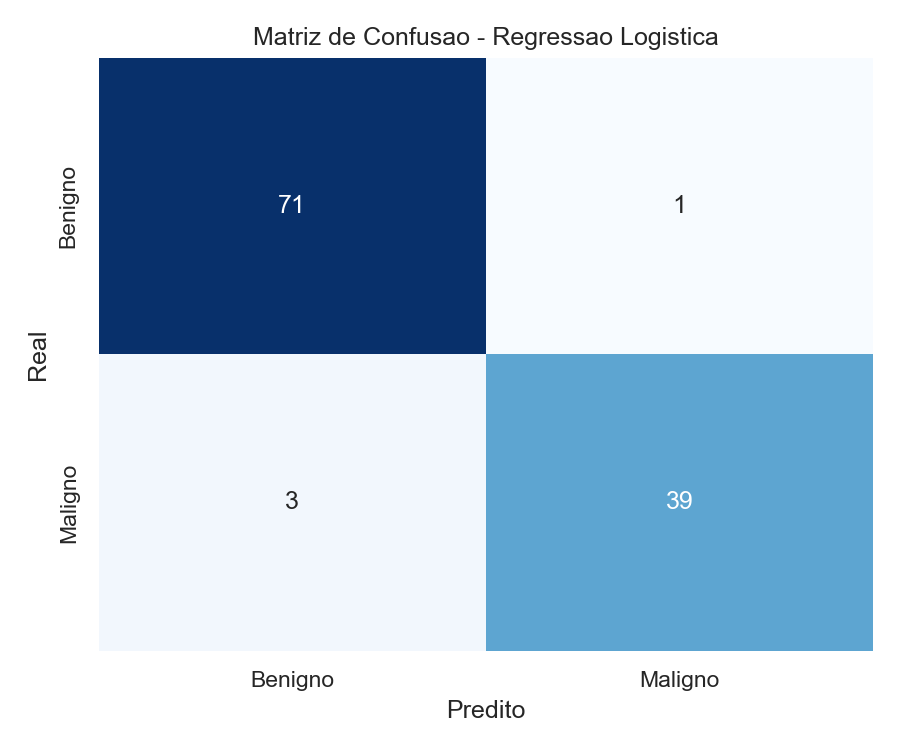

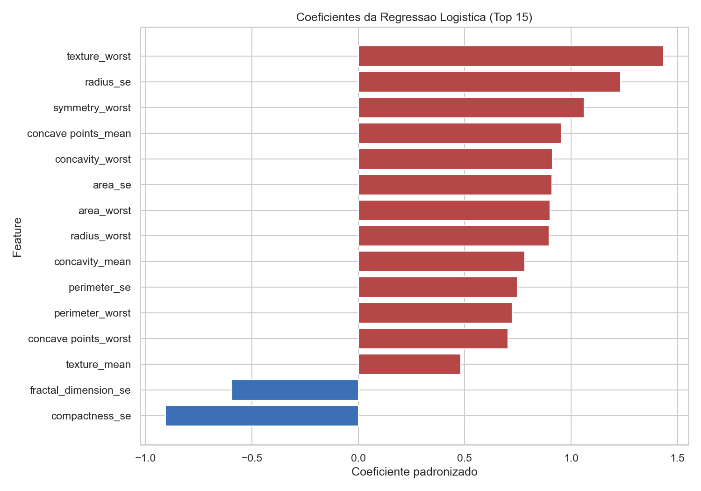

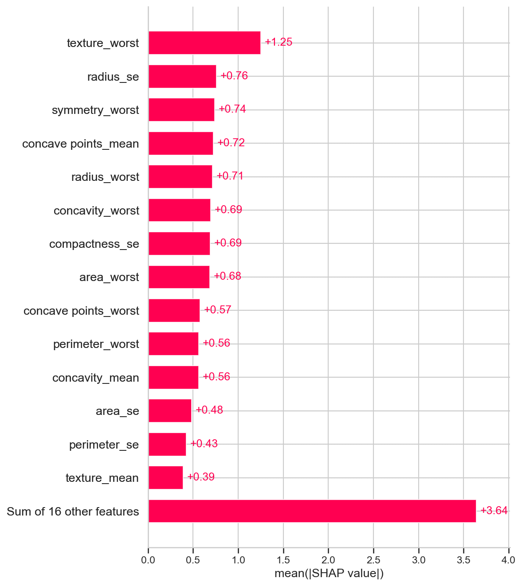

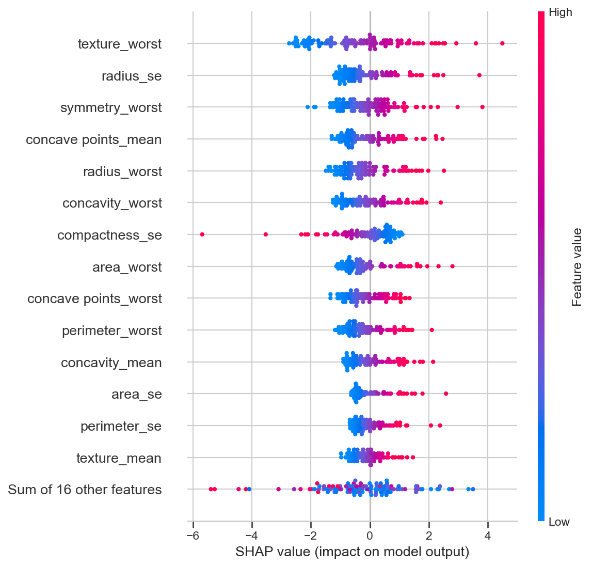

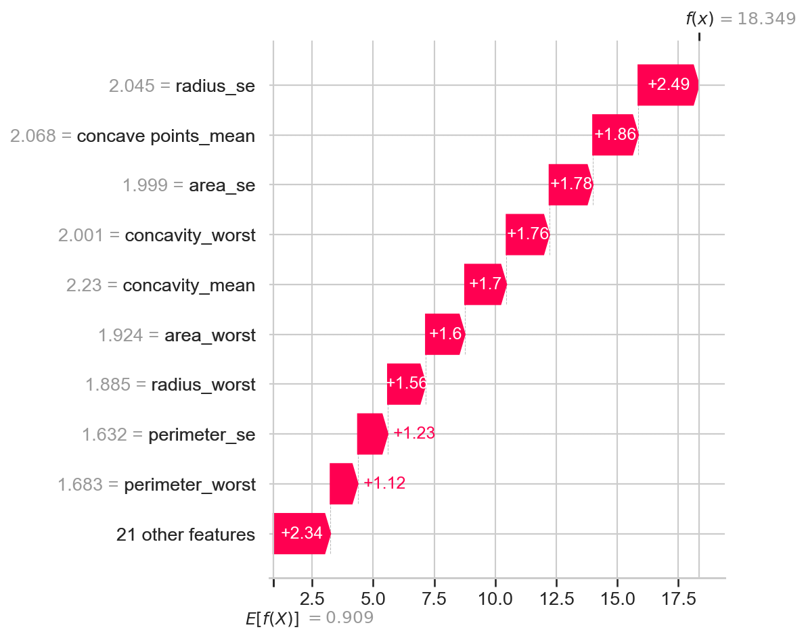

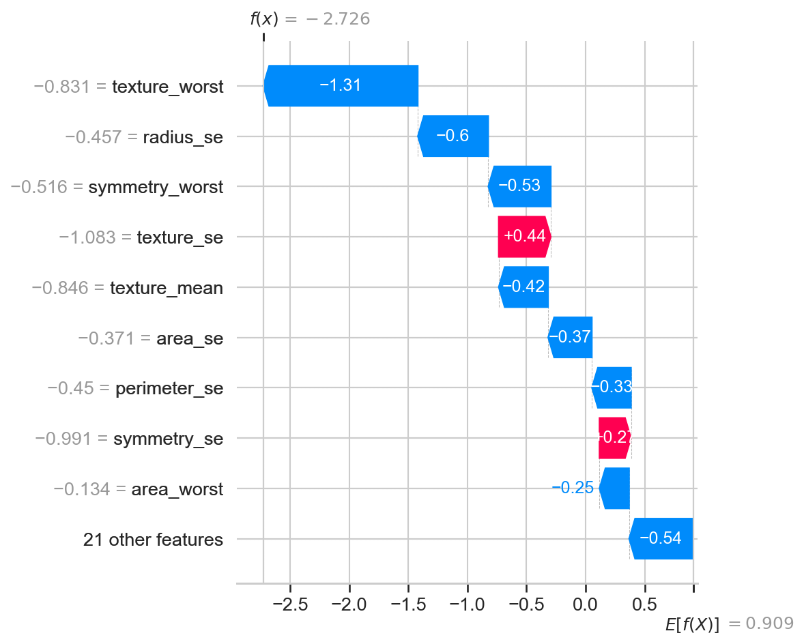

---

## 7. Ajuste Controlado (Tuning)

### 7.1 Motivação

O modelo base apresentava 3 falsos negativos. Isso me gerou um incômodo, e busquei forma para reduzir esse número sem interferir demais no modelo.

### 7.2 Estratégias Testadas

| Variação                | Descrição                                               |
| ----------------------- | ------------------------------------------------------- |
| class_weight='balanced' | Aumenta penalidade para erros na classe minoritária (M) |
| Threshold tuning        | Testados limiares 0.50, 0.45, 0.40, 0.35                |

### 7.3 Resultados do Tuning

| Modelo       | Threshold | Accuracy   | Recall M   | F1 M       | FN    | FP    |
| ------------ | --------- | ---------- | ---------- | ---------- | ----- | ----- |
| **balanced** | **0.50**  | **0.9737** | **0.9524** | **0.9639** | **2** | **1** |
| baseline     | 0.50      | 0.9649     | 0.9286     | 0.9512     | 3     | 1     |

O uso do `class_weight='balanced'` já foi suficiente para melhorar o modelo, sem precisar ajustar o threshold de decisão.

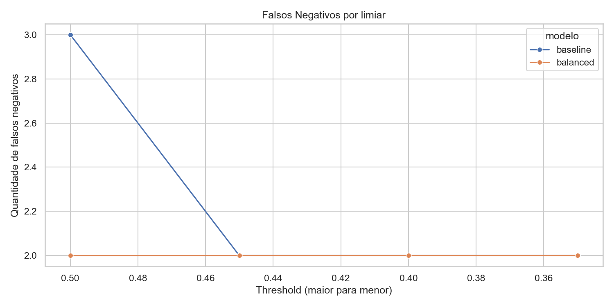

### 7.4 Decisão

O modelo ajustado foi adotado como **modelo final oficial** por:

- Reduzir falsos negativos de 3 → 2 (houve pequena melhoria no erro mais crítico)
- Melhorarou:
  - recall (0.9286 → 0.9524)
  - F1 (0.9512 → 0.9639) e accuracy (0.9649 → 0.9737)
  - Manteve falsos positivos em 1

---

## 8. Modelo Final Oficial

### 8.1 Configuração

```
LogisticRegression(class_weight='balanced', max_iter=1000, random_state=42)
```

### 8.2 Métricas Finais (conjunto de teste, n=114)

| Métrica                    | Valor  |
| -------------------------- | ------ |
| Accuracy                   | 0.9737 |
| Precision maligno          | 0.9756 |
| Recall maligno             | 0.9524 |
| F1 maligno                 | 0.9639 |
| Verdadeiros Negativos (TN) | 71     |
| Falsos Positivos (FP)      | 1      |
| Falsos Negativos (FN)      | 2      |
| Verdadeiros Positivos (TP) | 40     |

### 8.3 Artefatos de Entrega

| Artefato             | Caminho                                   |
| -------------------- | ----------------------------------------- |
| Modelo treinado      | `outputs/models/modelo_final_oficial.pkl` |
| Scaler               | `outputs/models/scaler_final_oficial.pkl` |
| Script de inferência | `src/inferencia.py`                       |
| Predições de teste   | `outputs/models/predicoes_teste.csv`      |

### 8.4 Script de Inferência (`src/inferencia.py`)

O `inferencia.py` é o ponto de entrada para uso do modelo fora do ambiente de treinamento — como se fosse um sistema hospitalar ou médico querendo classificar novos pacientes sem precisar abrir nenhum notebook.

**Como usar:**

```bash
python src/inferencia.py --input dados_novos.csv --output resultado.csv
```

- `--input`: CSV com as 30 features do tumor (mesmo formato do dataset original, sem coluna de diagnóstico)
- `--output`: caminho onde o CSV de resultado será salvo

**O que o script faz internamente:**

1. Carrega o modelo final (`modelo_final_oficial.pkl`) e o scaler (`scaler_final_oficial.pkl`)
2. Aplica o `StandardScaler` nos dados de entrada — exatamente como foi feito no treino
3. Calcula a probabilidade de malignidade para cada amostra
4. Salva o CSV com as features originais + duas colunas adicionais:

| Coluna         | Tipo    | Descrição                                        | Exemplo  |
| -------------- | ------- | ------------------------------------------------ | -------- |
| `predicao`     | inteiro | **1 = Maligno** / **0 = Benigno**                | `1`      |
| `prob_maligno` | decimal | Probabilidade (0.0 a 1.0) de o tumor ser maligno | `0.9999` |

Essa separação entre treinamento e inferência é uma prática essencial de MLOps — garante que o modelo possa ser utilizado em qualquer ambiente sem dependência dos notebooks de desenvolvimento.

---

## 9. Análise Crítica Final

### 9.1 Pontos Fortes

- **Alta performance no geral:** accuracy de 97,4% com apenas 3 erros de 114 amostras.
- **Recall elevado na classe crítica:** 95,2% dos casos malignos foram detectados corretamente.
- **Explicabilidade total:** tanto via coeficientes (interpretação direta) quanto via SHAP (contribuição de cada feature por amostra).
- **Pipeline de execução facilmente reprodutível:** do download do dataset à inferência, todo o fluxo é executável via notebooks e scripts.
- **Ajuste conservador:** a melhoria de performance foi obtida dentro do escopo, sem complexidade desnecessária.

### 9.2 Limitações Gerais

- **Dataset pequeno:** embora os resultados sejam bons, a generalização para dados clínicos reais precisa ser validada com amostras maiores e mais diversas.
- **Colinearidade entre features:** features como radius, perimeter e area são altamente correlacionadas, podendo interferir em coeficientes da Regressão Logística.
- **2 falsos negativos remanescentes:** mesmo com o ajuste, o modelo ainda falha em diagnosticar corretamente 2 casos malignos, deixando evidente que é super necessário a avaliação de um médico real.
- **Dados de uma única fonte:** todos os dados vêm da mesma instituição , limitando a diversidade da amostra.

---

## 10. Conclusão

Este projeto demonstrou que é possível construir um sistema de Machine Learning com alta capacidade e interpretabilidade para **apoiar** o diagnóstico de câncer de mama, utilizando dados clínicos estruturados.

A Regressão Logística que é um modelo simples e interpretável — atingiu 97,4% de accuracy com recall de 95,2% para a classe maligna, evidenciando que complexidade algorítmica nem sempre é necessária para bons resultados.

A combinação de Feature Importance e SHAP permitiu não apenas medir performance, mas **entender** e **explicar** as decisões do modelo.

O sistema foi desenvolvido como **ferramenta de apoio à decisão médica**, e não como substituto do médico/profissional de saúde. Os 2 falsos negativos são uma prova real disso.

---

## Referências

- Wolberg, W.H., Street, W.N., & Mangasarian, O.L. (1995). _Breast Cancer Wisconsin (Diagnostic) Data Set_. UCI Machine Learning Repository.
- Lundberg, S.M. & Lee, S.I. (2017). _A Unified Approach to Interpreting Model Predictions_. NeurIPS.
- Scikit-learn Documentation: https://scikit-learn.org/stable/
- SHAP Documentation: https://shap.readthedocs.io/
